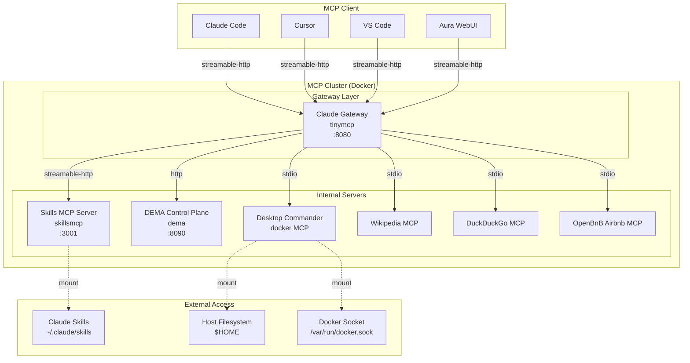

# MCP Cluster
This project aim to create an MCP bsaed playground for agentic AI. **It is not a production ready setup** and uses few open source publically available MCP servers.
While TinyMCP gateway and SkillsMCP server are custom implementation that you can find among my repositories. 

A Docker-based cluster that aggregates multiple MCP (Model Context Protocol) servers into a single, unified gateway. This setup allows any MCP-compatible client to access a rich set of tools through one endpoint.

## Deployment Architecture



## Components

### 1. MCP Gateway (tinymcp)

The central gateway that aggregates all MCP servers into a single entry point. Built from the [tinymcp](https://github.com/your-org/tinymcp) project.

- **Port**: `8080`
- **Transport**: streamable-http
- **Features**:
  - Server registry and discovery
  - Session management
  - Tool aggregation from all connected servers
  - Health monitoring
  - REST API for management (`/docs`)

### 2. Skills MCP Server (skillsmcp)

A FastMCP-based skills provider that exposes Claude Code skills as MCP tools. Built from the [skillsmcp](https://github.com/your-org/skillsmcp) project.

- **Port**: `3001`
- **Transport**: streamable-http
- **Features**:
  - Loads skills from `~/.claude/skills` directory
  - Provides `list_skills`, `get_skill`, `list_skill_files` tools
  - Hot-reload support for skill development
  - Skills directory mounted from `./skills`

### 3. DEMA Control Plane (dema)

The MCP Control Plane (Deus Ex Machina) is an enterprise-grade orchestration engine that manages complex, multi-stage agentic workflows. Built from the [dema](../dema) project.

- **Port**: `8090`
- **Transport**: HTTP (FastAPI REST API)
- **Features**:
  - Multi-stage plan orchestration with state machine enforcement
  - 4-tier context management (P0-P3 memory hierarchy)
  - Human-in-the-loop approval gates for high-risk decisions
  - Policy engine for decision validation
  - Gateway client for tool execution via the MCP Gateway
  - LLM integration for autonomous decision-making
  - Immutable audit trail for all operations

**API Endpoints**:

| Endpoint | Method | Description |
|----------|--------|-------------|
| `/health` | GET | Health check |
| `/v1/info` | GET | System information |
| `/v1/plans` | POST | Create a new orchestration plan |
| `/v1/plans/{id}` | GET | Get plan details |
| `/v1/plans/{id}/state` | GET | Get plan state (P0-P3 context) |
| `/v1/plans/{id}/run` | POST | Start/continue plan execution |
| `/v1/plans/{id}/pause` | POST | Pause plan execution |
| `/v1/plans/{id}/resume` | POST | Resume paused plan |
| `/v1/plans/{id}/stages` | POST | Add a stage to a plan |
| `/v1/plans/{id}/audit` | GET | Get audit logs |
| `/v1/approvals/{id}` | POST | Handle approval request |
| `/docs` | GET | Swagger API documentation |

### 4. Desktop Commander MCP

A Docker MCP server for file system operations, shell execution, and Docker management.

- **Image**: `mcp/desktop-commander:latest`
- **Access**: stdio (through gateway)
- **Features**:
  - File system read/write operations
  - Shell command execution
  - Docker container management
  - Host filesystem access via volume mount

### 5. Wikipedia MCP

A Docker MCP server for Wikipedia search and article retrieval.

- **Image**: `mcp/wikipedia-mcp:latest`
- **Access**: stdio (through gateway)
- **Features**:
  - Wikipedia article search
  - Full article content retrieval
  - Language support

### 6. DuckDuckGo MCP

A Docker MCP server for web search via DuckDuckGo.

- **Image**: `mcp/duckduckgo:latest`
- **Access**: stdio (through gateway)
- **Features**:
  - Web search results
  - News search
  - Safe search options

### 7. OpenBnB Airbnb MCP

A Docker MCP server for Airbnb-style accommodation search.

- **Image**: `mcp/openbnb-airbnb:latest`
- **Access**: stdio (through gateway)
- **Features**:
  - Vacation rental search
  - Price comparison
  - Availability checking

## Quick Start

### Prerequisites

- Docker Engine 24.0+
- Docker Compose v2.20+
- At least 2GB available memory

### 1. Build All Images

```bash
./build.sh
```

This will:
- Build the tinymcp gateway image
- Build the skillsmcp server image
- Build the dema control plane image
- Pull all Docker MCP server images
- Create necessary config files

### 2. Start the Cluster

```bash
./start.sh
```

The cluster will:
- Start all 7 services
- Wait for the gateway to become healthy
- Display access points and client configuration

### 3. Stop the Cluster

```bash
./stop.sh
```

To also remove built images:

```bash
./stop.sh --remove-images
```

## Configuration

### Gateway Config

Edit `config/tinymcp/config.json` to add or modify MCP servers:

```json
{
  "mcpServers": {
    "skills-provider": {
      "transport": "streamable-http",
      "url": "http://skillsmcp:3001/mcp"
    }
  }
}
```

### Skills Config

Edit `config/skillsmcp/skills.settings.json` to configure skill directories:

```json
{
  "directories": ["/home/user/.claude/skills"],
  "reload": false,
  "supporting_files": "template",
  "http": {
    "enabled": true,
    "port": 3001,
    "host": "0.0.0.0",
    "path": "/mcp"
  }
}
```

### Adding Custom Skills

Place your skill directories in the `skills/` folder:

```
skills/
└── my-skill/
    ├── SKILL.md
    └── references/
        └── guide.md
```

Each skill requires a `SKILL.md` file at its root.

## MCP Client Setup

### Claude Code

No configuration needed — Claude Code auto-discovers MCP servers via the gateway.

### Cursor

Add to your Cursor MCP settings:

```json
{
  "mcpServers": {
    "gateway": {
      "transport": "streamable-http",
      "url": "http://localhost:8080/mcp"
    }
  }
}
```

### VS Code (with MCP extension)

Add to your VS Code MCP configuration:

```json
{
  "mcpServers": {
    "gateway": {
      "transport": "streamable-http",
      "url": "http://localhost:8080/mcp"
    }
  }
}
```

### Custom Client

Any MCP-compatible client can connect to the gateway:

```python
import httpx

# List available tools
response = httpx.get("http://localhost:8080/tools")
tools = response.json()["tools"]

# Call a tool
response = httpx.post(
    "http://localhost:8080/call",
    json={
        "tool": "list_skills",
        "arguments": {}
    }
)
```

## API Endpoints

### Gateway (http://localhost:8080)

| Endpoint | Method | Description |
|----------|--------|-------------|
| `/` | GET | Root endpoint |
| `/healthz` | GET | Health check |
| `/docs` | GET | Swagger API documentation |
| `/tools` | GET | List all available tools |
| `/sessions` | POST | Create a new MCP session |
| `/registry/servers` | GET | List registered servers |
| `/registry/servers` | POST | Register a new server |
| `/registry/servers/{name}` | DELETE | Unregister a server |
| `/registry/external` | GET | List external registry servers |
| `/registry/external/activate` | POST | Activate external servers |

### Skills Server (http://localhost:3001)

| Endpoint | Method | Description |
|----------|--------|-------------|
| `/mcp` | GET/POST | MCP streamable-http endpoint |
| `/sse` | GET | SSE endpoint for skills |

### DEMA Control Plane (http://localhost:8090)

| Endpoint | Method | Description |
|----------|--------|-------------|
| `/health` | GET | Health check |
| `/v1/info` | GET | System information |
| `/v1/plans` | POST | Create orchestration plan |
| `/v1/plans/{id}` | GET | Get plan details |
| `/v1/plans/{id}/state` | GET | Get plan state |
| `/v1/plans/{id}/run` | POST | Start plan execution |
| `/v1/plans/{id}/pause` | POST | Pause plan |
| `/v1/plans/{id}/resume` | POST | Resume plan |
| `/v1/plans/{id}/stages` | POST | Add stage to plan |
| `/v1/plans/{id}/audit` | GET | Get audit logs |
| `/v1/approvals/{id}` | POST | Handle approval |
| `/docs` | GET | Swagger documentation |

## Docker Compose Commands

### Manual docker compose usage

```bash
# Start in detached mode
docker compose -f compose_docker.yml -p mcp-cluster up -d

# Stop all services
docker compose -f compose_docker.yml -p mcp-cluster down

# View logs
docker compose -f compose_docker.yml -p mcp-cluster logs -f

# View service status
docker compose -f compose_docker.yml -p mcp-cluster ps

# Rebuild and restart
docker compose -f compose_docker.yml -p mcp-cluster up -d --build
```

### Environment Variables

| Variable | Default | Description |
|----------|---------|-------------|
| `COMPOSE_FILE` | `./compose_docker.yml` | Path to compose file |
| `COMPOSE_PROJECT_NAME` | `mcp-cluster` | Docker project name |
| `HOME` | (current user) | Home directory for desktop-commander |
| `SERPAPI_API_KEY` | (none) | API key for search-dependent MCP servers |
| `LLM_BASE_URL` | `http://localhost:1234/v1` | LLM endpoint for DEMA |
| `LLM_API_KEY` | `not-needed-for-local` | LLM API key |
| `LLM_MODEL_NAME` | `hermes-3-llama-3.1` | LLM model for DEMA |
| `LLM_MAX_TOKENS` | `4096` | Max tokens for DEMA |
| `LLM_TEMPERATURE` | `0.2` | Temperature for DEMA |
| `MEMORY_P2_THRESHOLD` | `2000` | DEMA P2 compaction threshold |
| `MEMORY_P3_TTL` | `3600` | DEMA P3 signal TTL (seconds) |

## Troubleshooting

### Gateway not healthy

```bash
# Check gateway logs
docker compose -f compose_docker.yml -p mcp-cluster logs mcp-gateway

# Restart gateway
docker compose -f compose_docker.yml -p mcp-cluster restart mcp-gateway
```

### Skills not loading

```bash
# Check if skills directory is mounted
docker compose -f compose_docker.yml -p mcp-cluster exec skillsmcp ls -la /home/user/.claude/skills

# Verify skills.settings.json
docker compose -f compose_docker.yml -p mcp-cluster exec skillsmcp cat /app/skills.settings.json
```

### Port conflicts

If port 8080 or 3001 is already in use:

```bash
# Find what's using the port
lsof -i :8080
lsof -i :3001

# Stop the conflicting service or change ports in compose_docker.yml
```

### Clean restart

```bash
./stop.sh --remove-images
./build.sh
./start.sh
```

## Project Structure

```
aiplay/
├── build.sh              # Build all Docker images
├── start.sh              # Start the MCP cluster
├── stop.sh               # Stop the MCP cluster
├── compose_docker.yml    # Docker Compose configuration
├── .env.example          # Environment variables template
├── README.md             # This file
├── config/
│   ├── tinymcp/
│   │   ├── config.json   # Gateway server configuration
│   │   └── secrets.json  # Secrets/API keys storage
│   └── skillsmcp/
│       └── skills.settings.json  # Skills server configuration
└── skills/               # Custom skills directory
```

## Source Projects

- **tinymcp**: [../tinymcp](../tinymcp) — MCP Gateway server
- **skillsmcp**: [../skillsmcp](../skillsmcp) — FastMCP Skills Provider
- **dema**: [../dema](../dema) — MCP Control Plane (Deus Ex Machina) orchestration engine
- **Docker MCP servers**: Official MCP Docker images from the MCP ecosystem

## License

# aiplay
